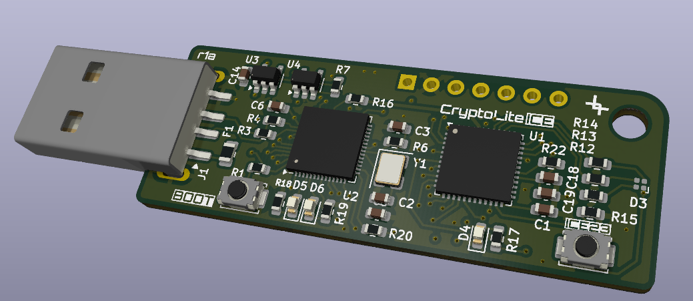
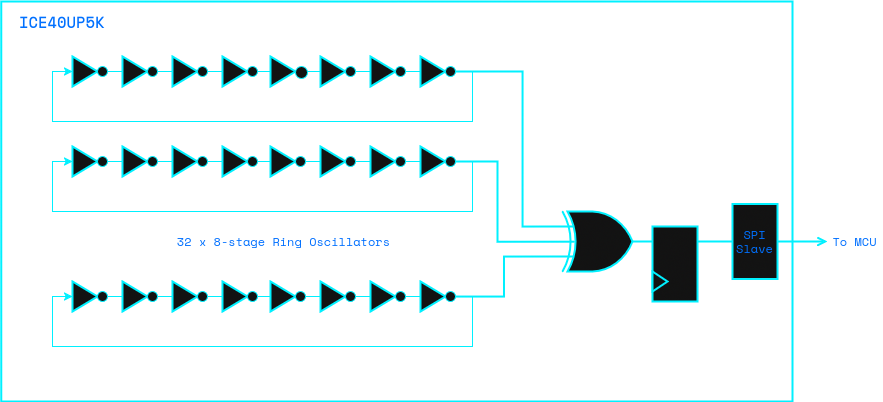
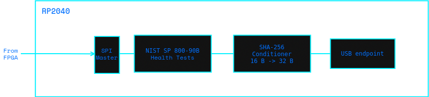

# CryptoLite-ICE

Open-source **True Random Number Generator (TRNG)** combining a Lattice
**iCE40UP5K** FPGA and a Raspberry Pi **RP2040** microcontroller on a single
USB stick. The FPGA generates entropy from 32 parallel ring oscillators; the
RP2040 reads it over SPI, applies SP 800-90B health tests and SHA-256
conditioning, and exposes the conditioned output to the host through a
binary USB Vendor protocol.

The board is part of the [lut7.dev](https://lut7.dev) research initiative.



---

## Table of contents

- [Architecture](#architecture)
- [Hardware](#hardware)
  - [Board overview](#board-overview)
  - [Power architecture](#power-architecture)
  - [RP2040 to iCE40 signals](#rp2040-to-ice40-signals)
  - [SPI bus sharing](#spi-bus-sharing)
- [Repository layout](#repository-layout)
- [Building from source](#building-from-source)
  - [FPGA bitstream](#fpga-bitstream)
  - [RP2040 firmware](#rp2040-firmware)
- [First-time flashing](#first-time-flashing)
- [Host script](#host-script)
- [USB protocol reference](#usb-protocol-reference)
- [Status LEDs](#status-leds)
- [Entropy quality](#entropy-quality)
- [Roadmap / known limitations](#roadmap--known-limitations)
- [License](#license)

---

## Architecture

```
+----------------------------------------------------------------------+
|  Host PC                                                             |
|   `-- criptolite-ice.py  (pyusb / libusb)                           |
+----------------------------------------------------------------------+
                                |  USB Full-Speed
                                |  Vendor class, bulk endpoints
+----------------------------------------------------------------------+
|  RP2040 (criptolite_rp firmware)                                    |
|   +---------------------------------------------------------------+  |
|   | TinyUSB Vendor   -->  protocol.c  (binary command dispatcher) |  |
|   +---------------------------------------------------------------+  |
|           |                       |                       |          |
|           v                       v                       v          |
|      flash_writer            cmd_get_random          ice40 reset     |
|      (re-flash FPGA          (raw -> NIST ->         / clock          |
|       bitstream)             SHA-256 -> out)         control          |
|           |                       |                                  |
|           v                       v                                  |
|       PIO SPI master  -->   FPGA SPI slave  -->   ring oscillators   |
+----------------------------------------------------------------------+
                                |
                                |  SCK / SO (shared with U6 flash)
                                v
+----------------------------------------------------------------------+
|  iCE40UP5K (cryptolite_trng_spi bitstream)                          |
|   +--------------+    +------------------+   +-------------------+    |
|   | ro_trng (32  | -> | spi_trng_slave   | ->| SO pin 17         |    |
|   | ring osc.s)  |    | (latches on each |   | (shared with      |    |
|   | 1 bit @48MHz |    |  SCK falling)    |   |  flash DO, HiZ)   |    |
|   +--------------+    +------------------+   +-------------------+    |
+----------------------------------------------------------------------+
```

The FPGA's SPI slave is **transparent** — it ignores `SS_B` and simply shifts
out a fresh random bit on every falling edge of `SCK`. While the FPGA is
running, the external SPI configuration flash is held de-selected (CS
HIGH), so its `DO` line stays in HiZ and the FPGA can drive the bus
freely. To re-flash the FPGA the firmware asserts `CRESET_B` LOW (which
returns the FPGA's IO cells to HiZ) and then talks to the flash as SPI
master.

---

## Hardware

Only the schematic is published, under [`hardware/`](hardware/).

### Board overview

| Ref | Part | Description |
|-----|------|-------------|
| U1 | Lattice ICE40UP5K-SG48ITR | FPGA, QFN-48, 5k LUTs |
| U2 | Raspberry Pi RP2040 | Dual-core Arm Cortex-M0+, QFN-56 |
| U3 | TLV70212 | 1.2 V LDO - iCE40 core supply |
| U4 | TLV70233 | 3.3 V LDO - board 3.3 V rail |
| U5 | W25Q32JV | 4 MB QSPI flash - RP2040 firmware (XIP) |
| U6 | W25Q32JV | 4 MB SPI flash - iCE40 bitstream |
| Y1 | 12 MHz crystal | RP2040 XTAL reference |
| D3 | MHPA1010RGBDT | RGB LED driven by iCE40 (open-drain via `SB_RGBA_DRV`) |
| D4 | LED | iCE40 CDONE indicator |
| D5, D6 | LED | RP2040 status LEDs (LD1, LD2) |
| SW1 | Push button | RP2040 BOOTSEL |
| SW2 | Push button | iCE40 user button (BTN_ICE) |
| J1 | USB Type-A | USB device connector |
| J2 | 1x7 header | iCE40 user I/O expansion |

### Power architecture

```
USB VBUS (5 V) --> F1 (Polyfuse) --+--> U4 TLV70233 --> +3V3
                                   |                     (RP2040 IOVDD,
                                   |                      iCE40 VCC_IO,
                                   |                      U5 / U6 VCC)
                                   `--> U3 TLV70212 --> +1V2
                                                         (iCE40 VCC core
                                                          + VCCPLL)
RP2040 internal VREG: +3V3 --> +1V1   (RP2040 digital core)
```

### RP2040 to iCE40 signals





| RP2040 GPIO | iCE40 pin | Net | Direction (RP2040 -> iCE40) | Use |
|------------:|----------:|-----|-----------------------------|-----|
| GPIO2  | -  | RP_LD1     | OUT | Status LED LD1 (active HIGH) |
| GPIO3  | -  | RP_LD2     | OUT | Status LED LD2 (active HIGH) |
| GPIO6  | 11 | ICE_APP_1  | I/O | Reserved (unused in this release) |
| GPIO7  | 10 | ICE_APP_0  | I/O | Reserved (unused in this release) |
| GPIO8  | 17 | ICE_SI     | OUT | **SPI MOSI** -> flash DI / FPGA SPI_SI |
| GPIO11 | 14 | ICE_SO     | IN  | **SPI MISO** <- flash DO / FPGA SPI_SO |
| GPIO12 | 16 | ICE_SSn    | OUT | Flash chip-select (active LOW). Held HIGH while talking to the FPGA. |
| GPIO13 | 15 | ICE_SCK    | OUT | SPI clock |
| GPIO18 | 8  | ICE_RESET  | OUT | iCE40 `CRESET_B` (active LOW) |
| GPIO25 | 44 | ICE_CLK    | OUT | iCE40 GBIN5, 48 MHz from `CLK_GPOUT` |
| GPIO29 | 7  | ICE_DONE   | IN  | iCE40 `CDONE` (HIGH = configured) |

> The labels `ICE_SI` / `ICE_SO` are PCB net names. In practice, **`ICE_SI`
> carries MISO** (flash DO + FPGA driving on pin 17) and **`ICE_SO` carries
> MOSI** (flash DI on pin 14). The firmware honours this, but new readers
> often expect the opposite — the SI/SO labels reflect the iCE40 slave
> perspective during configuration, not the master/slave roles in this
> design.

### SPI bus sharing

The same physical SPI bus is shared between the RP2040 (master), the SPI
flash U6 (configuration storage) and the iCE40 (slave once configured).
Bus ownership is decided by `SS_B` and `CRESET_B`:

| Mode | Bus master | Flash U6 | iCE40 |
|------|------------|----------|-------|
| **Programming bitstream** | RP2040 (PIO SPI) | Selected (CS LOW) | Held in CRESET (HiZ) |
| **TRNG operation** | RP2040 (PIO SPI) | De-selected (CS HIGH => DO HiZ) | Drives `SO` with random bits |
| **FPGA boot** | iCE40 master SPI | Selected by iCE40 itself | Reads bitstream from U6 |

GPIO8/11/12/13 do **not** map to the RP2040's hardware SPI peripheral on
the default pin mux; the firmware uses a [PIO-based SPI](mcu/spi_pio.pio)
implementation.

---

## Repository layout

```
cryptoliteICE/
├── hardware/
│   └── cryptoliteICE_sch.pdf      board schematic (full PCB kept private)
├── doc/                           board renders and block diagrams
├── rtl/                           iCE40UP5K bitstream
│   ├── ro_cell.v                  ring-oscillator stage (8x SB_LUT4)
│   ├── ro_trng.v                  32x ROs XOR'd into 1 random bit per clk
│   ├── cryptolite_trng_spi.v      top: ro_trng + SPI slave + status LED
│   ├── spi_trng_slave.v           SCK-edge synchroniser -> MISO drive
│   ├── cryptolite_trng_spi.pcf    iCE40 pin assignments
│   ├── tb_ro_trng.v               iverilog testbench for ro_trng
│   └── build_cryptolite_trng_spi.sh
├── mcu/                           RP2040 firmware (USB Vendor class)
│   ├── main.c
│   ├── protocol.c/.h              binary command dispatcher
│   ├── flash_writer.c/.h          USB-driven FPGA bitstream programmer
│   ├── trng.c/.h                  SPI sampler (master <-> FPGA slave)
│   ├── rng_pipeline.c/.h          ring -> pool -> SHA-256 conditioner
│   ├── nist_health.c/.h           SP 800-90B RCT + APT continuous tests
│   ├── sha256.c/.h                conditioning function
│   ├── led_status.c/.h            2-LED status state machine
│   ├── ice40.c/.h                 FPGA reset / clock / CDONE control
│   ├── spi_pio.c/.h/.pio          PIO SPI Mode 0 master
│   ├── spi_flash.c/.h             W25Q32 driver
│   ├── usb_descriptors.c          Vendor class descriptors
│   ├── tusb_config.h              TinyUSB config (Vendor only)
│   ├── pins.h                     GPIO assignments
│   ├── CMakeLists.txt
│   └── build_criptolite_rp.sh
└── host/
    ├── criptolite-ice.py          host CLI (pyusb)
    └── 99-cryptolite.rules        udev rule for non-root USB access
```

Per-folder READMEs live in [`rtl/`](rtl/), [`mcu/`](mcu/) and
[`host/`](host/).

---

## Building from source

### Prerequisites

- **FPGA toolchain** — open-source IceStorm: `yosys`, `nextpnr-ice40`, `icepack`.
- **RP2040 toolchain** — `arm-none-eabi-gcc`, CMake (>= 3.13), `make`, and a
  Raspberry Pi Pico SDK checkout. The SDK is **not** vendored here: point
  `PICO_SDK_PATH` at your own copy, or clone it as `pico-sdk/` at the repo root.
- **Host script** — Python 3 (>= 3.9) with `pyusb` (and a working `libusb-1.0`).

```bash
# Provide the Pico SDK (one option: clone it at the repo root)
git clone --recurse-submodules https://github.com/raspberrypi/pico-sdk.git
export PICO_SDK_PATH="$PWD/pico-sdk"

# Set up a virtualenv for the host script
python3 -m venv host/.venv
host/.venv/bin/pip install -r host/requirements.txt
```

### FPGA bitstream

```bash
bash rtl/build_cryptolite_trng_spi.sh
# -> build/cryptolite_trng_spi/cryptolite_trng_spi.bin
```

The script runs:

```
yosys -> synth_ice40 -top cryptolite_trng_spi
nextpnr-ice40 --up5k --package sg48
icepack
```

with a couple of permissive flags (`--ignore-loops` for the RO feedback,
`--timing-allow-fail` because the asynchronous oscillators are not part of
the timed design). Synthesis reports an `Fmax ~ 140 MHz` for the
synchronous fabric — well above the 48 MHz reference clock.

If the toolchain is not on your `PATH`, set `ICE40_TOOLCHAIN` to the directory
that holds `yosys`, `nextpnr-ice40` and `icepack`.

### RP2040 firmware

```bash
bash mcu/build_criptolite_rp.sh
# -> build/criptolite_rp/criptolite_rp.uf2
```

The build links against TinyUSB (Vendor class only), `pico_bootrom` (for
`reset_usb_boot`) and the standard Pico libraries.

---

## First-time flashing

The board ships blank. The very first time, you need to put the RP2040
into BOOTSEL mode manually:

1. Hold **SW1** (BOOTSEL) and connect the USB cable.
2. The board enumerates as `RPI-RP2` mass-storage.
3. Copy the firmware:
   ```bash
   cp build/criptolite_rp/criptolite_rp.uf2 /media/$USER/RPI-RP2/
   sync
   ```
4. The RP2040 reboots and enumerates as `2e8a:000f CryptoLite-RP`.

To grant non-root access to the device through `pyusb`, install the udev
rule once:

```bash
sudo cp host/99-cryptolite.rules /etc/udev/rules.d/
sudo udevadm control --reload-rules
sudo udevadm trigger
```

Once the RP2040 is running, the FPGA can be flashed with the host
script (no more BOOTSEL needed):

```bash
host/criptolite-ice.py update-fpga build/cryptolite_trng_spi/cryptolite_trng_spi.bin
```

---

## Host script

```
host/criptolite-ice.py status
host/criptolite-ice.py random -n 32
host/criptolite-ice.py random -n 1048576 -o rng.bin
host/criptolite-ice.py random --bits 1000000 -o rng.bin
host/criptolite-ice.py update-fpga    bitstream.bin   [-y]
host/criptolite-ice.py update-rp2040  firmware.uf2    [-y]
```

| Subcommand | Description |
|------------|-------------|
| `status` | Print board status (CDONE, LED state, NIST health, bytes seen). |
| `random` | Generate random bytes. Without `-o`, prints hex to stdout. With `-o file`, writes raw bytes. Use `-n N` for bytes or `--bits N` (rounded up to whole bytes). |
| `update-fpga` | Erase U6 and program a new bitstream. Asks for confirmation unless `-y` is passed. The FPGA is held in reset during programming and rebooted at the end. |
| `update-rp2040` | Reboot the RP2040 to BOOTSEL ROM and copy a `.uf2` file to the resulting `RPI-RP2` mass-storage volume. Asks for confirmation unless `-y` is passed. |

The host iterates internally for large `random` requests (the firmware
caps a single response at 256 B), so any byte count up to available memory
can be requested in a single CLI invocation. See [`host/README.md`](host/README.md)
for setup details.

---

## USB protocol reference

Vendor class, two bulk endpoints (`OUT 0x01`, `IN 0x81`, 64 B max packet).
All multi-byte fields are little-endian.

```
Request   : [cmd:1] [rsv:1=0x00] [payload_len:2]  [payload...]
Response  : [cmd:1] [status:1]   [payload_len:2]  [payload...]
```

`cmd` is echoed in the response. `status = 0x00` on success or one of the
`PROTO_ERR_*` codes (see [`mcu/protocol.h`](mcu/protocol.h)).

| `cmd` | Name | Request payload | Response payload |
|------:|------|------------------|------------------|
| `0x01` | `STATUS` | — | 12 B status block (see below) |
| `0x02` | `GET_RANDOM` | `u32 N` (1...256) | `N` conditioned bytes |
| `0x03` | `FLASH_BEGIN` | `u32 total_size` | — |
| `0x04` | `FLASH_DATA` | `u32 offset` + bytes | — |
| `0x05` | `FLASH_END` | `u32 crc32` (0 = skip) | `u8 cdone` |
| `0x06` | `REBOOT_BOOTLOADER` | — | (no return) |

`STATUS` payload (12 bytes):

```
offset  size  field
0       1     CDONE bit (1 = FPGA configured)
1       1     LED state enum
2       1     NIST health status
3       1     TRNG paused flag
4       4     bits processed by NIST (u32, LE)
8       2     RCT max run length (u16, LE)
10      2     APT max occurrences (u16, LE)
```

---

## Status LEDs

Two on-board LEDs (D5 = LD1, D6 = LD2, both active HIGH) encode the
firmware state:

| State | LD1 | LD2 |
|-------|-----|-----|
| `BOOT` | off | off |
| `NO_FPGA` (CDONE = 0) | red, solid | off |
| `IDLE` (FPGA up, ready) | off | green, solid |
| `BUSY` (RNG transfer) | amber, fast blink (in phase) | amber, fast blink (in phase) |
| `PROGRAM` (flashing FPGA) | amber, alternating | amber, alternating |
| `ERROR` (flash JEDEC mismatch) | red, fast blink | off |

The iCE40 RGB LED (D3) shows **solid green** when the bitstream is
running.

---

## Entropy quality

Quick sanity check on a 1 Mbit (125 000 B) capture from a freshly
configured board:

```
Shannon entropy   : 7.99845 bits/byte (max 8.00000)
Mean              : 127.45      (ideal 127.5)
Byte freq min/max : 426 / 567   (ideal 488)
```

The conditioner is `SHA-256(16 raw bytes) -> 32 conditioned bytes`, on top
of continuous SP 800-90B RCT (Repetition Count) and APT (Adaptive
Proportion) tests. Run a longer capture through e.g. NIST STS or
`dieharder` for production qualification.

---

## Roadmap / known limitations

- **Hardware SPI instead of PIO.** The RP2040 SPI bus to the iCE40 and the
  configuration flash is wired to general-purpose GPIO (8/11/12/13), not to the
  RP2040 hardware SPI peripheral (SPI0/SPI1) pins, so the firmware is forced to
  bit-bang SPI through PIO (see [`mcu/spi_pio.pio`](mcu/spi_pio.pio)). A future
  board revision should reassign the bus to hardware-SPI-capable pins to free
  the PIO and simplify the driver.

---

## License

Released under the **Apache License 2.0** — see [`LICENSE`](LICENSE).

Building the RP2040 firmware additionally pulls in the Raspberry Pi Pico SDK
and TinyUSB, which are not included here and carry their own licenses.

— [controlpaths.com](https://controlpaths.com) | [lut7.dev](https://lut7.dev)
